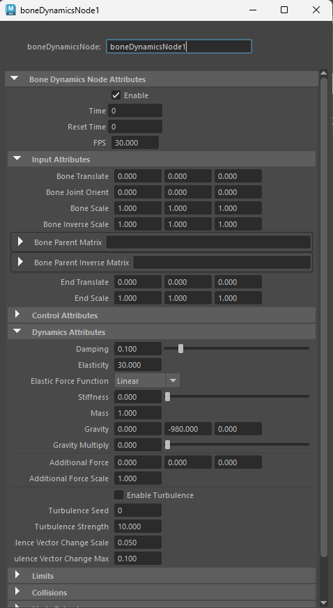
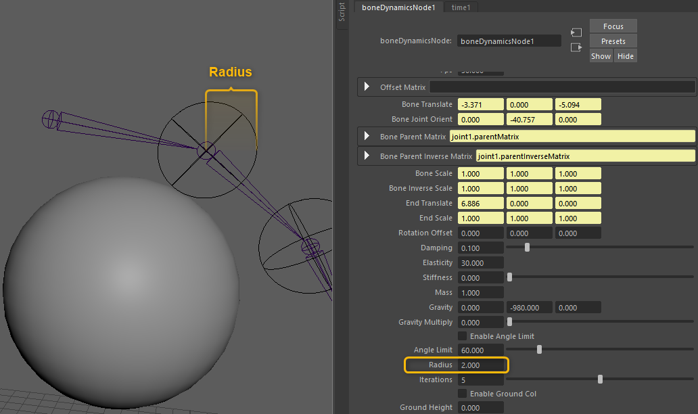
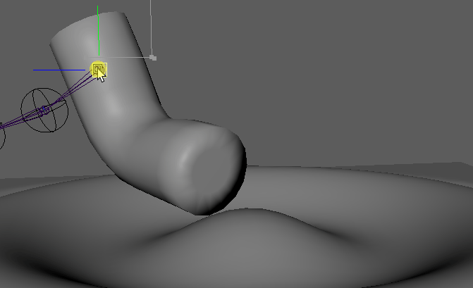
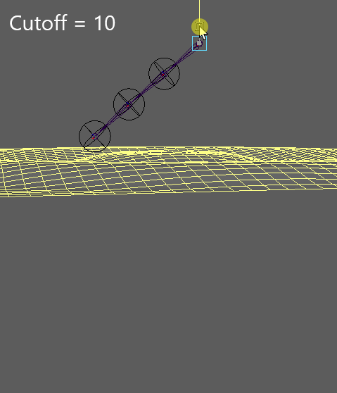
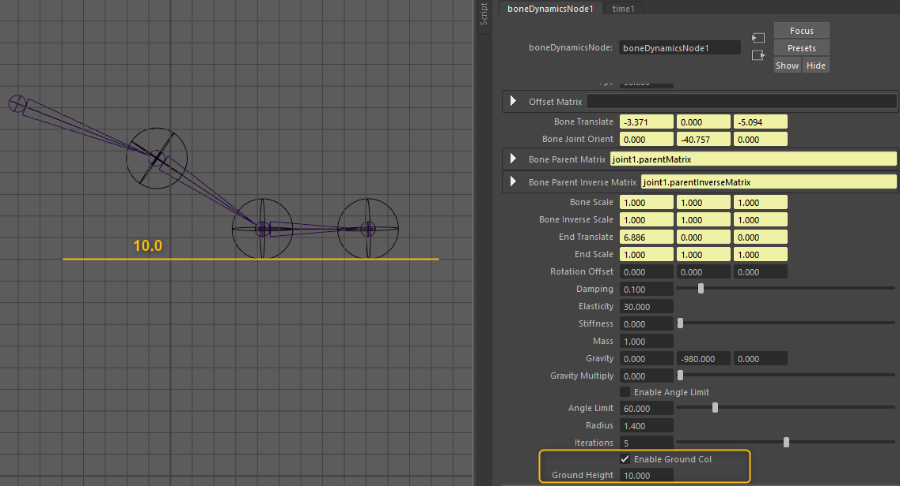
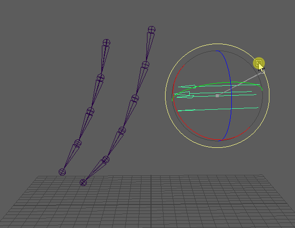
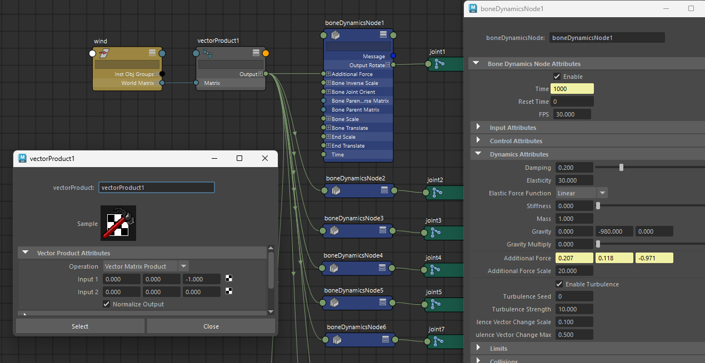

# boneDynamicsNode
   
A custom node that applies dynamics to one section of a joint chain. It can be included directly into the rig, or Bake & Purge over the rig.  

> ⚠**Warning**⚠  
> Internal Use ID `0x7b001` is used.

## Installaion  
1. Put [boneDynamicsNode.mll](#Pre-built-plug-ins) in `C:\Users\<USERNAME>\Documents\maya\<MAYAVERSION>\plug-ins`.  
2. Load "boneDynamicsNode.mll" from Plug-in Manager.  

> **Note**  
> If [AEboneDynamicsNodeTemplate.mel](scripts/AEboneDynamicsNodeTemplate.mel) is placed in `C:\Users\<USERNAME>\Documents\maya\<MAYAVERSION>\scripts`, the layout of the Attribute Editor will change.  
> 
> 

## Basic Usage
Create any joint chain and connect the `boneDynamicsNode` per section. The minimum required connections are as follows:

### Required Connections

- `Time`  
- `Bone Translate`  
- `Bone Joint Orient`  
- `Bone Parent Matrix`  
- `Bone Parent Inverse Matrix`  
- `End Translate`  
- `Output Rotate`  

To rotate joint1, with joint2 as the tip...


Let's move the current frame to 1 or later and move the root. The joint-chain shakes!  


> 💡**Required Settings**  
> Please check the following settings to ensure correct results:  
> - **Disable** "Cached Playback".
> - Set "Playback speed" to **"Play every frame"**.

> 💡**Requirements for Joint**  
> Joint chain must meet the requirements [here](#Requirements-for-Joint).

> 💡**Sample Script**  
> [basic_usage.py](sample_scripts/basic_usage.py) is a script to connect bonedynamicsNode to any joint chain. Please select and execute them in order from the root of the joint to the tip of the joint.  

### Attributes to Check
- `Enable` : Turning it off disables all calculations.  
- `Reset Time` : Dynamics are disabled when the current frame is equal to or less than this value. In other words, start frame of the simulation.  
- `Fps` : Used to calculate delta time. Enter a value equal to the FPS of the scene. Default is 30.  

### Dynamics Attributes
- `Damping` : Attenuates speed. The larger the value, the harder it is to accelerate.  
- `Elasticity` : Force to return to the original posture.  
- `Elastic Force Function` __(*Experimental)__ : The type of elastic force.  
  - `Linear`: Normal.  
  - `Quadratic`: The elastic force increases when it is moved away from the original posture.  
  - `Cubic`: The elastic force increases **even more** when it is moved away from the original posture.
- `Stiffness` : Suppresses changes between frames (steps). Setting to 1 will result in loss of motion.  
- `Mass` : Affects the force to return to the original posture.  
- `Gravity` : If Y-up and the unit is in centimeters, set [0,-980,0].  
- `Gravity Multiply` : Will be multiplied by Gravity.  
- `Additional Force` : Any additional force.  
- `Additional Force Scale` : Scale value of additional force.  
- `Enable Turbulence`: Enable turbulence force.  
- `Turbulence Seed`: Seed value for randomly changing the vector direction.  
- `Turbulence Strength`: Scale value of turbulence force.  
- `Turbulence Vector Change Scale`: Change in turbulence force vector.  
- `Turbulence Vector Change Max`: Maximum change in turbulence force vector.  

### Bake to Keyframes
Select the joint and execute "Bake Simulation" from the "Key" menu. Then delete the boneDynamicsNode.  

### Requirements for Joint
- Rotate should be [0,0,0], with only the Joint Orient having a value.
- Do not edit rotatePivot, rotatePivotTranslate, scalePivot, or scalePivotTranslate.  
- Rotate Order is only available for xyz.  
- Rotate Axis should remain [0,0,0].  
- Leave Inherits Transform checked.  
- Leave Offset Parent Matrix at its default value.  
- Receive InverseScale from the parent Scale and leave Segment Scale Compensate checked. Shear not supported.  

All of the above checkpoints can be satisfied by making joints as usual.  

## Features
### Collisions

5 types of collisions are available: **Sphere, Capsule, Infinite plane, Mesh, and Ground**.  

- `Radius` : Radius of the end-joint.  
- `Iterations` : Higher values increase the accuracy of collisions. Recommended value is 3 to 5. 0 disables collisions.  

Collisions are determined by the sphere centered around the end-joint. The radius of the end-joint is set with the Radius attribute.



The attributes that connect the collider are in a list, so you can use more than one. Ground Collision does not need connections.  
 


> 💡**Visualize Radius**  
> Place a nurbsSphere or implicitSphere as a child of end-joint and connect `Radius`.  
> 

#### Sphere, Capsule, Infinite plane


The required connections for these three types of collisions are as follows.  

- `Sphere Col Matrix` : Connect the sphere collider worldMatrix.  
- `Sphere Col Radius` : Radius of sphere collider.  
- `Capsule Col Matrix A` `Capsule Col Matrix B` : Connect worldMatrix on one side of the capsule collider.  
- `Capsule Col Radius A` `Capsule Col Radius B` : Connect the radius of one side of the capsule collider.  
- `Infinite Plane Col Matrix` : Connect worldMatrix of infinite plane collider.  

> 💡**Note**  
> Colliders can be created with [maya_expressionCollision (expcol)](https://github.com/akasaki1211/maya_expressionCollision), but it is not necessary to use it. Any collider can be used as long as the required attributes are connected.  
>   

#### Mesh (*Experimental)



Any mesh can be used for collisions. Compared to other types of collisions, mesh collisions are more loaded and less stable, so their use is not recommended.  

- `Mesh Collider` : Connect worldMesh of any mesh.  
- `Mesh Col Cutoff` : Max distance for mesh collision detection.  

> 💡**Note**  
> - As this is an **experimental** feature, it may be unstable.  
> - All edges of the collision mesh should be made with **soft edges**.  
> - If the collision mesh has a large number of polygons, it will increase the processing load.  
> - If the collision mesh is not a closed shape, use `Mesh Col Cutoff` to control the range of detections.  
> 
>   

#### Ground



A horizontal infinite plane collision. It can be used only with the enable and ground height attribute, no connections are needed.  

- `Enable Ground Col` : Enable ground collision.  
- `Ground Height` : Height of the ground.  


### Angle Limitation

The `Angle Limit` attribute allows for limiting the rotation angle of bones. It has a higher priority than collision, so depending on the posture, it may be penetrated in the colliders.


> 💡**Visualize Angle**  
> Place an implicitCone node and a transform nodes in the same space as the joint, and set and connect their attributes as in the following image:  
>   
> ⚠️If joint.ty and tz contain values, cone direction will not match accurately.  

### Specify Target Pose

The converging pose can be manipulated by duplicating the joint-chain and connecting Rotate to `Rotation Offset`.  


### Offset Transform

You can cancel the transform by connecting the worldMatrix of the node you do not want affected (such as the root controller of character) to the `Offset Matrix`.  
The `Offset Matrix Weight` attribute adjusts the amount of influence. Please note that he `Offset Matrix Weight` must be **the same values** for all joints in the chain, otherwise unnatural behavior will occur.  


### Supports Scale per Section
Connecting each scale value to `Bone Scale`, `Bone Inverse Scale`, and `End Scale` enables a scale per section.  
> ⚠Please avoid non-uniform scales.  


### Branching


Branching is possible, but good results are obtained with joints like the one on the left of the image. The right one does not give good results.


### Additional Force / Turbulence Force

The vector entered in `Additional Force` is multiplied by the `Additional Force Scale` and added to the external force. Unlike `Gravity`, it takes mass into account.  

Enabling `Enable Turbulence` adds a vector that changes direction randomly to the external force. The change accumulates starting from the `Reset Time`. Nodes with the same `Turbulence Seed` and `Reset Time` will generate the same turbulence vector.  

**Turbulence wind** can be represented by a combination of these features.  




---

> 💡**Sample Script**  
> [advanced_usage.py](sample_scripts/advanced_usage.py) is a script to connect bonedynamicsNode to any joint chain. Please select and execute them in order from the root of the joint to the tip of the joint.  
> - Enable per-section scaling.  
> - If place the collider created by expcol as a child of 'collider_grp', to be connected.  
> - If duplicate the joint-chain to be simulated and add '_target' to the end of the name, to allow manipulation of the target posture.  
> - If a node named "offset" exists, will be connected to cancel the transform.  
> - If a node named "wind" exists, it will be connected to the Additional Force.

## Pre-built plug-ins
Pre-built `boneDynamicsNode.mll` in the [plug-ins](./plug-ins) folder. Install to the appropriate Maya version and ready to use.  
|Version|Plug-in<br>(*Click on "Download raw file" at the link.)|
|---|---|
|Maya 2022 Update 5 win64|[Download](./plug-ins/2022/boneDynamicsNode.mll)|
|Maya 2023 Update 3 win64|[Download](./plug-ins/2023/boneDynamicsNode.mll)|
|Maya 2024 Update 2 win64|[Download](./plug-ins/2024/boneDynamicsNode.mll)|
|Maya 2025 Update 2 win64|[Download](./plug-ins/2025/boneDynamicsNode.mll)|

## How to Build  
For example, Maya 2024 in Windows:  
1. Install Visual Studio 2022
2. Install CMake 3.22.1 or higher
3. Donwload SDKs from [Maya API | Autodesk Platform Services (APS)](https://aps.autodesk.com/developer/overview/maya)
4. Set `devkitBase` path in the `DEVKIT_LOCATION` environment variable.  
5. Generate a project with the following command:
```
cd src
cmake . -Bbuild_2024 -G "Visual Studio 17 2022" -A x64
```
6. Build with Visual Studio or with the following command:
```
cmake --build build_2024
```

## Links
- [Maya用お手軽ボーンダイナミクスノード「boneDynamicsNode」詳細解説 - Qiita](https://qiita.com/akasaki1211/items/ddae66ec2d89d21bb2f4)
- [boneDynamicsNode Demo - Example of integration into FK rig - YouTube](https://www.youtube.com/watch?v=O5cpcMI_Jz0)